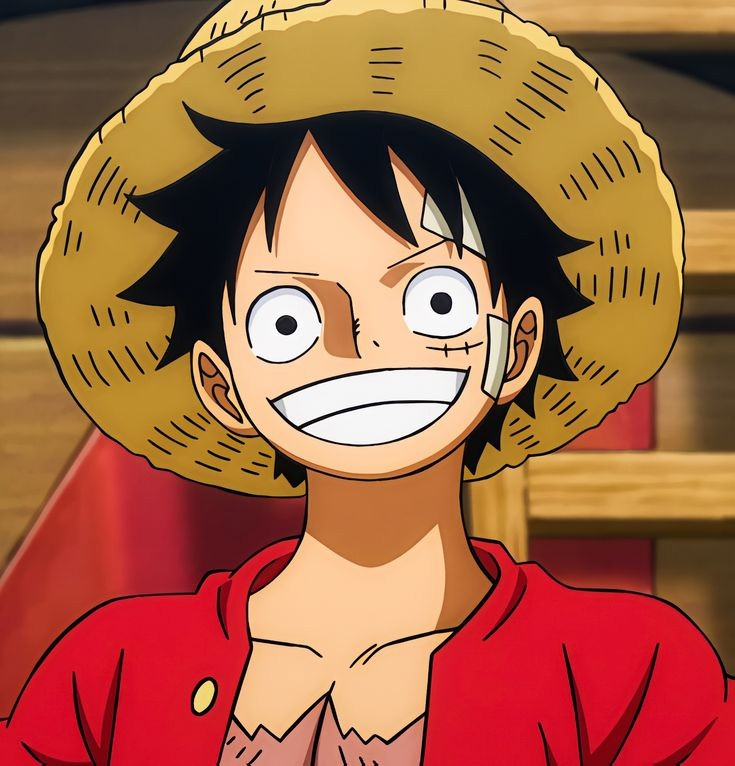
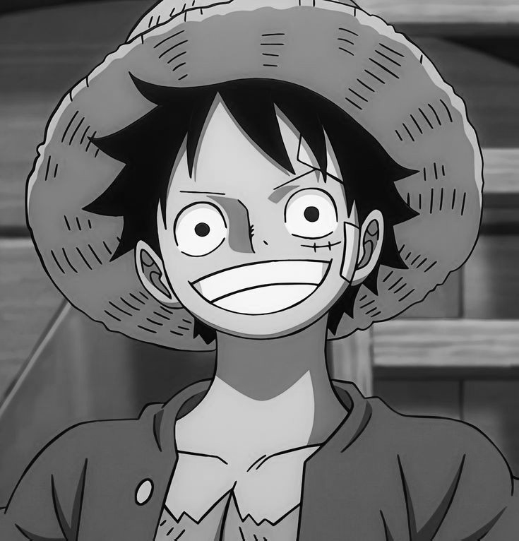
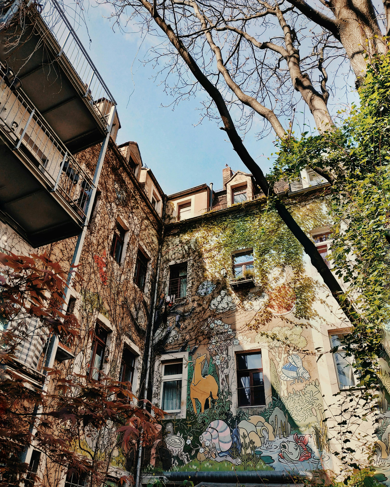

# 🖼️ Image Processing Filters Project

## 📘 Overview
This project is a **C++ console-based image processing application** that allows users to apply various filters and transformations to images interactively.  
It supports essential operations such as grayscale conversion, merging, rotation, cropping, and edge detection — all implemented efficiently with clean object-oriented design.

---

## 👨‍💻 Team Members
| ID | Name | Filters Implemented | Section |
|----|------|----------------------|----------|
| **20240515** | Mohamed Abdullah Abdul-Hafez | 1, 4, 7, 10 | All-B |
| **20240649** | Hisham Mohamed Fathy | 2, 5, 8, 11 | 35 |
| **20240692** | Youssef Sayed Ali | 3, 6, 9, 12 | 25 |

---

## ⚙️ Features (Filters)

| # | Filter Name | Description |
|---|--------------|-------------|
| 1  | **Grayscale** | Converts the image to shades of gray. |
| 2  | **Black & White** | Converts the image to pure black and white based on brightness threshold. |
| 3  | **Invert Colors** | Inverts each pixel color (creates a negative effect). |
| 4  | **Merge Images** | Merges two images by alternating pixels. |
| 5  | **Flip (Vertical / Horizontal)** | Flips the image either vertically or horizontally. |
| 6  | **Rotate (90°, 180°, 270°)** | Rotates the image clockwise by the chosen angle. |
| 7  | **Change Brightness** | Adjusts brightness (lighter or darker). |
| 8  | **Crop Image** | Cuts out a rectangular portion from the image. |
| 9  | **Add Frame** | Adds a colored border with custom RGB and thickness. |
| 10 | **Detect Edges** | Detects edges in the image using simple gradient detection. |
| 11 | **Resize Image** | Resizes image to given width and height. |
| 12 | **Blur Image** | Applies blur effect using block averaging. |

---

## 🧩 Project Structure
```
📂 Image_Processing_Filters/
├── main.cpp              # Main program
├── Image_Class.h         # Header for image class (handles loading/saving)
├── Image_Class.cpp       # Implementation of image handling
├── sample_images/        # Example input/output images (optional)
└── README.md             # Documentation
```

---

## 🖥️ How to Run

### 🔧 Requirements
- C++17 or later
- Compiler: **g++**, **Clang**, or **MinGW**
- The file `Image_Class.h` and `Image_Class.cpp` must be in the same directory (they handle image reading/writing)

---

### 🧠 Compilation

#### On Linux / macOS
```bash
g++ main.cpp Image_Class.cpp -o ImageFilters
```

#### On Windows (MinGW)
```bash
g++ main.cpp Image_Class.cpp -o ImageFilters.exe
```

---

### ▶️ Running the Program
Run the compiled file:

```bash
./ImageFilters
```

Then follow the prompts:
```
Enter photo name: input.bmp

===== MENU =====
1. Convert to grayscale
2. Convert to black & white
3. Invert colors
...
12. Blur image
13. Exit

Choose a filter number: 3
Enter output file name: inverted.bmp
--- Done! ---
```

**Result:** A new file named `inverted.bmp` will be created with the selected filter applied.

---

## 🧰 Example Filters

| Filter | Before                  | After                  |
|---------|-------------------------|------------------------|
| Grayscale |         |         |
| Invert Colors |     |  |
| Add Frame |  |    |

> *(Replace images above with your actual before/after examples in `sample_images/` folder.)*

---

## 🧠 Technical Highlights
- Developed in **modern C++** (object-oriented design).
- Uses an `ImageProcessor` class for modular filter implementation.
- Works with multiple image formats (e.g. `.bmp`, `.jpg`, `.png` depending on `Image_Class`).
- Cross-platform (Windows / Linux / macOS).
- Simple command-line interface for quick usage.

---

## 🧩 Code Overview

### Main Components:
- **`ImageProcessor` class** — Contains all 12 filters and manages image manipulation.
- **`Image_Class`** — Handles loading, saving, and pixel-level access.
- **Main Menu** — Displays filter list, reads user input, and applies chosen filters.

### Example Code Snippet:
```cpp
ImageProcessor imageProcessor("photo.bmp");
imageProcessor.convertToGrayscale();
imageProcessor.saveImage("gray_photo.bmp");
```

---

## 💡 Future Improvements
- Implement advanced filters (Gaussian blur, sharpening, histogram equalization).
- Add GUI (Qt or SFML) for a more visual experience.
- Support batch processing of multiple images.
- Include undo/redo functionality.

---

## 📜 License
This project was created for academic purposes.  
You may use or modify it freely for **educational and learning use** with proper attribution.

---

## 🏫 Course Information
Developed as part of the **Object-Oriented Programming(OOP) Course**  
**Faculty of Computers and Artificial Intelligence – Cairo University**

---

## ✨ Credits
**Developed with passion by:**
- Mohamed Abdullah Abdul-Hafez
- Hisham Mohamed Fathy
- Youssef Sayed Ali

---

⭐ *Thank you for checking out our project! If you like it, don’t forget to star the repository on GitHub.* ⭐